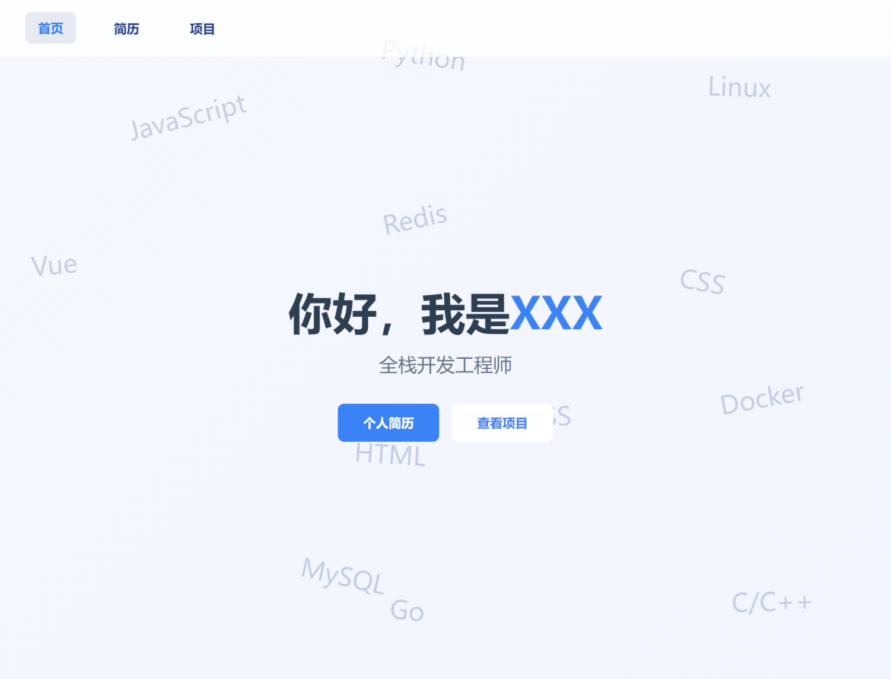
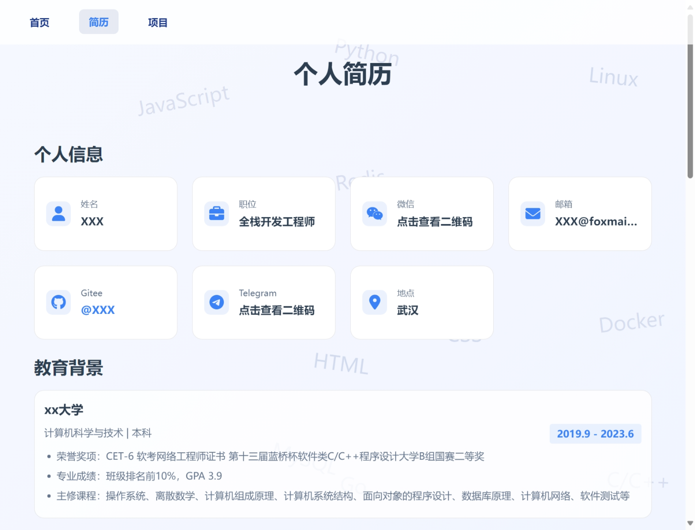
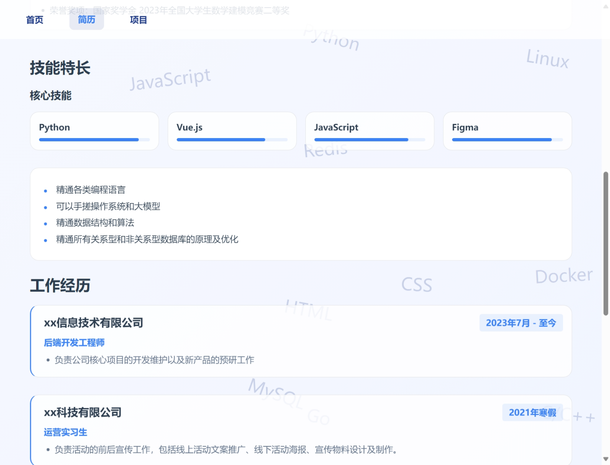
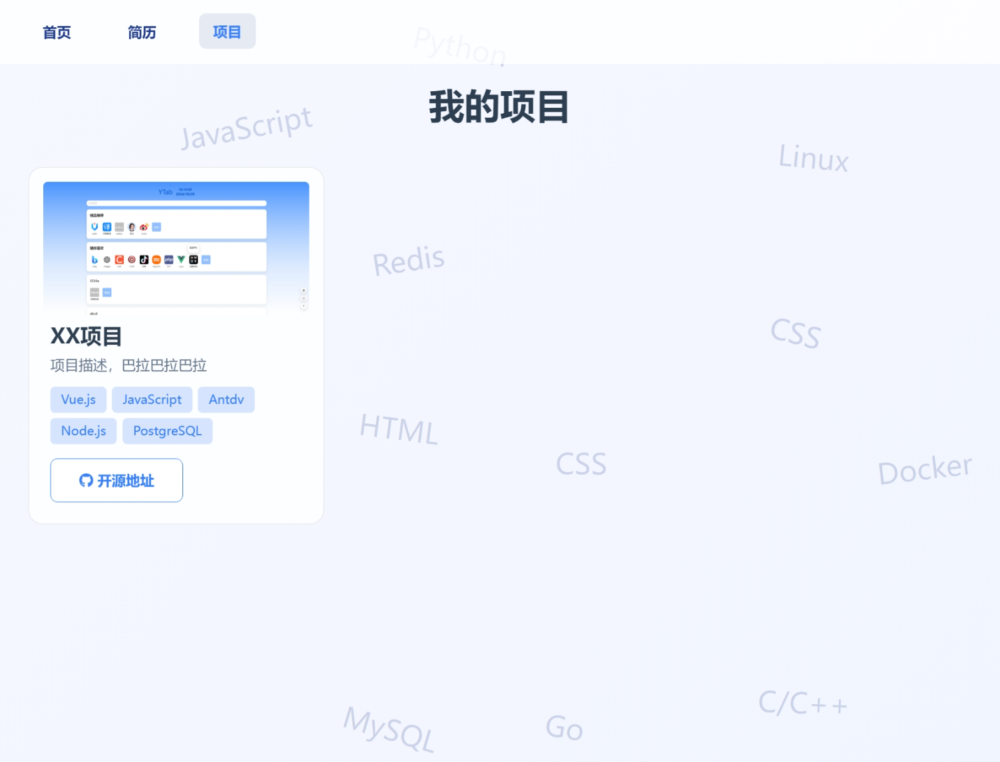

# 个人简历网站

## 项目简介

好看的不像实力派！

使用 vue3 + javascript 未引入第三方UI组件库，轻量简单

可作为个人网站使用，包含项目列表和个人简历两部分，其他页面可自行添加，本项目不包含任何个人真实信息

项目亮点：

- 简洁大方的UI设计风格
- 技术栈词云动态背景
- 移动端适配与响应式优化
- 数据与页面分离

使用方法：

```
npm install
npm run dev
npm run build  // 打包命令
```


**个人信息修改定制**

将data目录下的 **personalData.js.tmp** 重命名为 **personalData.js** 并修改其中的个人信息


**项目截图预览**








